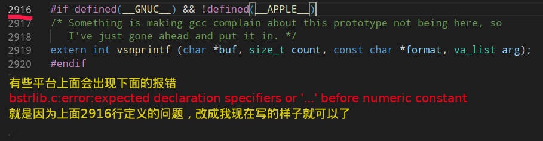

### 获得bsting.c bsting.h
从[https://github.com/websnarf/bstrlib](https://github.com/websnarf/bstrlib)下载的 bstrlib.h 和 bstrlib.c
```
make bstrlib.o
```


### 组成
bstrlib.o
    由 bstrlib.c 和 bstrlib.o 产生,你已经将它们引入了。
db.o
    由 db.c 和 db.h 产生,它包含了一个小型“数据库”程序集的代码。
shell.o
    由 shell.c 和 shell.h 产生,包含一些函数,是类似 curl 的一些命令运行起来更容易。
commands.o
    由 commands.c 和 commands.h 产生,包含了 devpkg 所需的所有命令并使它更易用。
devpkg
    它不会显式提到,但是它是 Makefile 在这一部分的目标。它由 devpkg.c 产生,包含用于整个程序的 main 函数。